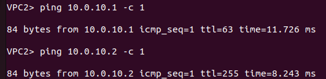

# Реализация небольшой сети офиса
## Топология


## Настрйока системы

### VPC1 (Клиент)
```
set pcname VPC1
ip 10.0.10.1/24 10.0.10.2
write
```

### VPC2 (Клиент)
```
set pcname VPC2
ip 10.0.20.1/24 10.0.20.2
write
```


### Router Cisco(vIOS)
```
enable
configure terminal
interface Gi0/0
no shutdown
interface Gi0/0.10
encapsulation dot1q 10
ip add 10.0.10.2 255.255.255.0
exit 
interface Gi0/0
no shutdown
interface Gi0/0.20
encapsulation dot1q 20
ip add 10.0.20.2 255.255.255.0
exit 
exit
copy running-config startup-config
```

### SwitchMain Cisco
```
enable 
configure terminal 
vlan 10
vlan 20
exit 
interface Gi0/0
switchport trunk allowed vlan 10,20
switchport trunk encapsulation dot1q
switchport mode trunk
exit 
interface Gi0/1
switchport trunk allowed vlan 10,20
switchport trunk encapsulation dot1q
switchport mode trunk
exit 
interface Gi0/2
switchport trunk allowed vlan 10,20
switchport trunk encapsulation dot1q
switchport mode trunk
exit 
exit 
copy running-config startup-config
```


### Switch1 Cisco
```
enable 
configure terminal 
vlan 10
vlan 20
exit 
interface Gi0/0
switchport trunk allowed vlan 10,20
switchport trunk encapsulation dot1q
switchport mode trunk
exit
interface Gi0/1
switchport trunk allowed vlan 10,20
switchport trunk encapsulation dot1q
switchport mode trunk
exit 
interface Gi0/2
switch access vlan 10
switch mode access
exit
exit 
copy running-config startup-config
```

### Switch2 Cisco
```
enable 
configure terminal 
vlan 10
vlan 20
exit 
interface Gi0/0
switchport trunk allowed vlan 10,20
switchport trunk encapsulation dot1q
switchport mode trunk
exit 
interface Gi0/1
switchport trunk allowed vlan 10,20
switchport trunk encapsulation dot1q
switchport mode trunk
exit 
interface Gi0/2
switch access vlan 20
switch mode access
exit
exit 
copy running-config startup-config
```
## Spanning-Tree
### Switch Main


### Switch1


### Switch2


## Ping:

  ### VPC1:
  

  ### VPC2:
  


## Отказоустойчивость:
  1. Отключим коммуникации между Switch1 и Switch2
  ```
  enable
  configure terminal
  interface Gi0/1
  shutdown
  exit
  exit
  ```
  2. Ping VPC1->VPC2

  
    